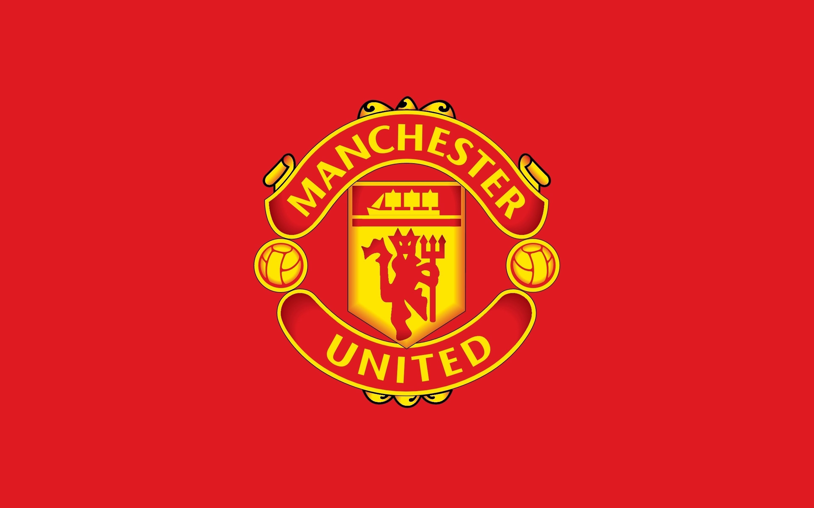
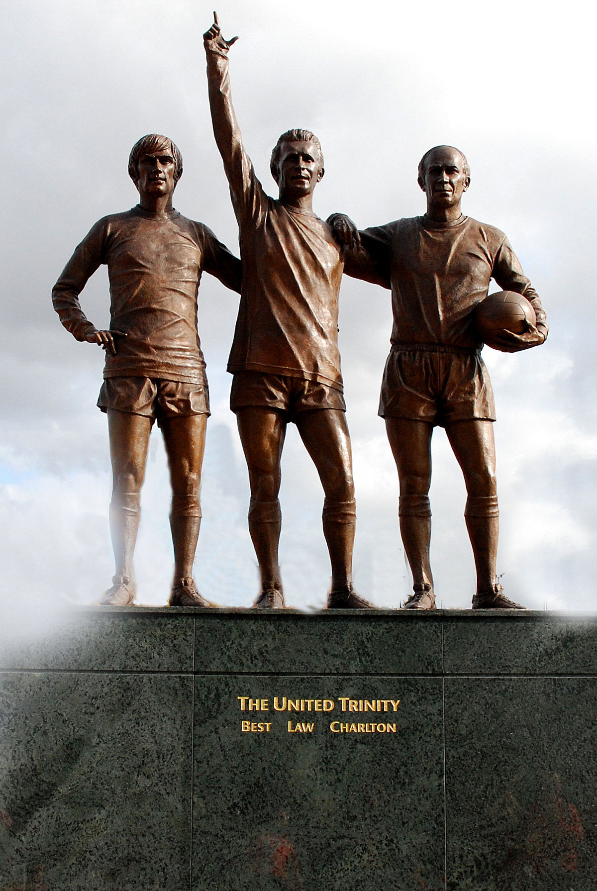
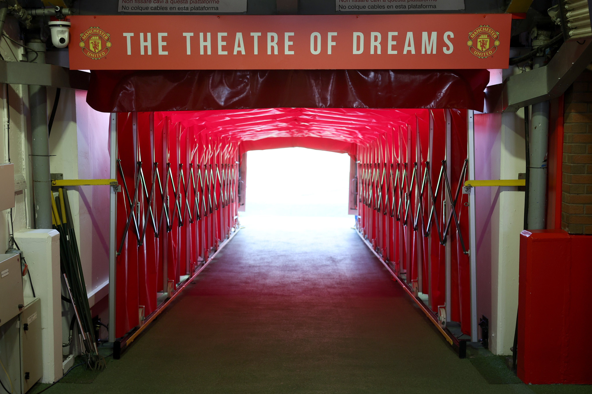
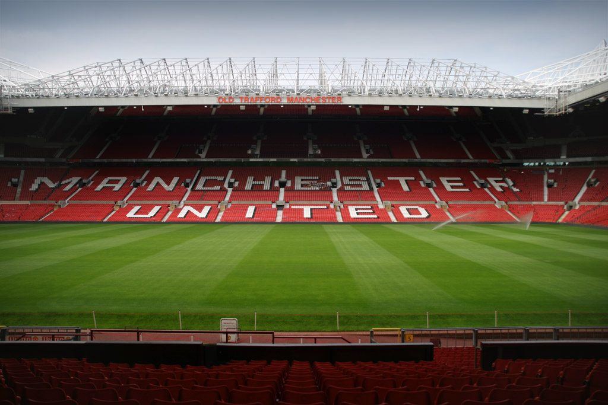

<html lang = "en">

<head>
  <meta charset="utf-8">
  <meta name="viewport" content="width=device-width">
  <title>one love</title>
  <link href="style.css" rel="stylesheet" type="text/css" />
</head>

<body>
  <main>
    <h1>MANCHESTER UNITED</h1>
    

      <h2>The Club</h2>
      
 Manchester United is a legendary English football club, known for its rich history, global fanbase, and dominance in English and European football. Founded in 1878, the club has won multiple Premier League and Champions League titles, with icons like Sir Alex Ferguson, Eric Cantona, Ryan Giggs, and Cristiano Ronaldo shaping its legacy. Old Trafford, their iconic stadium, is famously called the "Theatre of Dreams."

     

    
    
    

      <h2>Some of the Greatest Players</h2>
      <ul>
        <li>David Beckham</li>
        <li>Wayne Rooney</li>
        <li>Ryan Giggs</li>
        <li>Roy Keane</li>
        <li>Cristiano Ronaldo</li>
      </ul>
    

    
    

    <h3>The United Trintiy</h3>
      <ol>
        <li>George Best</li>
        <li>Dennis Law</li>
        <li>Bobby Charlton</li>
      </ol>
    

    
    

      <h2>The Theatre of Dreams</h2>
      
      
    

     
    

      
For more information on Manchester United,
      <a href="https://www.manutd.com/"> click here</a>

    

  </main>
</body>
</html>
